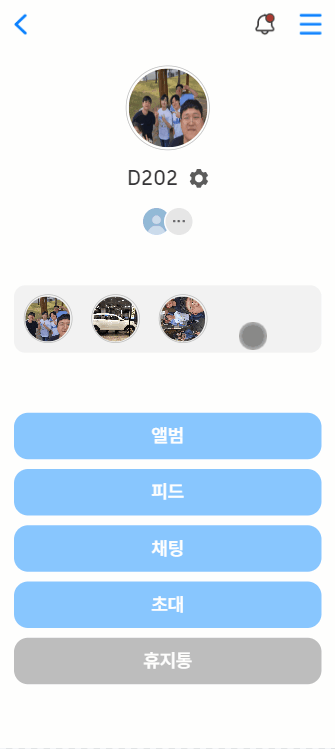
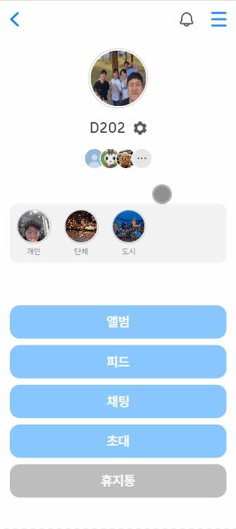
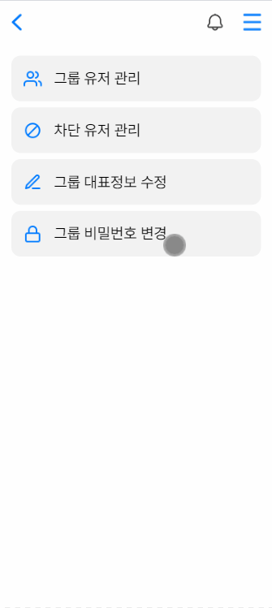
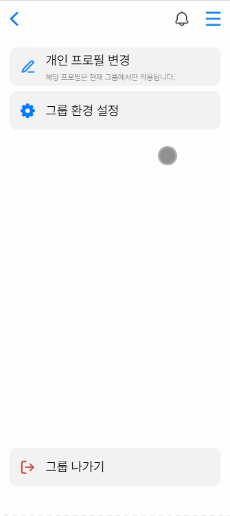
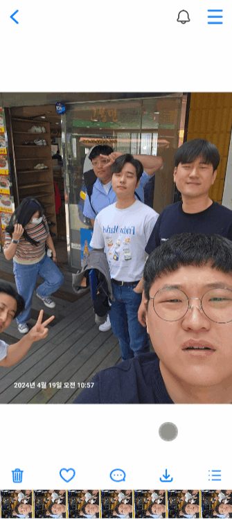
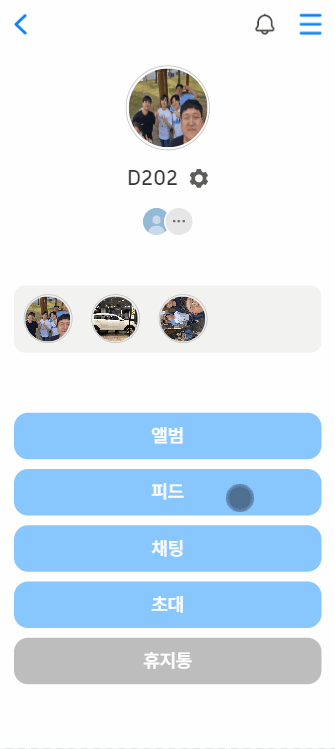
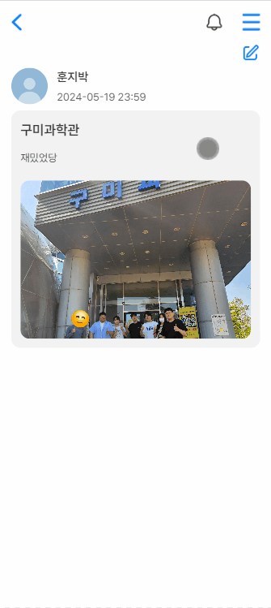
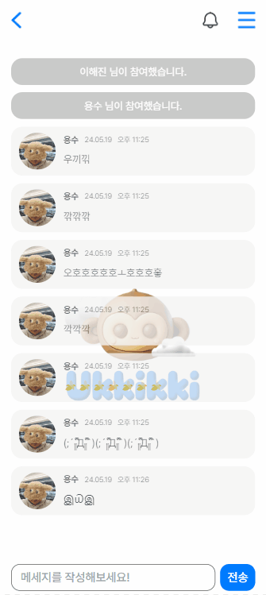
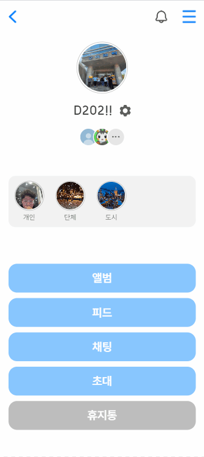

<div align="center">
  <br/>
  
  <br />
  <br />
  <br />
  <h1>GrabPic 📸</h1>
  <h3>작지만 가장 똑똑한, 나만의 생태 도감</h3> 
  <p>2024. 02. 19  ~  2024. 04. 05</p>
  <br/><br/>
</div>

## 🔗 목차

- [서비스 개요](#-서비스-개요)
- [팀원 소개](#-팀원-소개)
- [기술 스택](#-기술-스택)
- [주요 기능](#-주요-기능)
- [명세서](#-명세서)
- [시스템 아키텍처](#-시스템-아키텍처)
- [ERD](#erd)
- [서비스 실사용 화면](#-서비스-실사용-화면)

<br/>
<br/>


## 📃 서비스 개요

```markdown
세상에서 가장 편한 이미지 공유 서비스, Ukkikki🍌!

사용자가 업로드한 사진을 AI가 실시간 분류 기술을 통해 그룹

사용자가 카메라에 인식한 개체를 AI 실시간 개체 분류 기술을 통해 분석합니다.
동식물을 도감에 등록하고, 차트를 통해 수집 개체를 한 눈에 확인해보세요!
지도를 통해 주변에서 수집된 동식물 분포도 확인은 물론이고,
개체 상세정보를 조회하면 촬영한 사진을 기반으로 생성된 AI 영상도 제공된답니다.
```

<br/>
<br/>


## 👨‍👩‍👧‍👦 팀원 소개

<div align="middle">
  <table>
    <tr>
      <th colspan='3'>Front-End</th>
      <th colspan='2'>Back-End</th>
      <th colspan='1'>AI</th>
    </tr>
    <tr>
      <td height="140px" align="center"> 
        
      </td>
      <td height="140px" align="center"> 
          
      </td>
      <td height="140px" align="center"> 
          
      </td>
      <td height="140px" align="center"> 
          
      </td>
      <td height="140px" align="center"> 
          
      </td>
      <td height="140px" align="center"> 
          
      </td>
    </tr>
    <tr>
      <td align='center'>
        <a href="https://github.com/ByeongJo-Park">👑 박병조 (Leader)</a>
      </td>
      <td align='center'>
        <a href="https://github.com/Gyu-S">📸 양성규</a>
      </td>
      <td align='center'>
        <a href="https://github.com/sunoftwilight">📊 이해진</a>
      </td>
      <td align='center'>
        <a href="https://github.com/eat-alone">🎥 박지훈</a>
      </td>
      <td align='center'>
        <a href="https://github.com/sondongcheon">💾 손동천</a>
      </td>
      <td align='center'>
        <a href="https://github.com/Non-duality">🤖 이준희</a>
      </td>
    </tr>
    <tr>
      <td align='center'>
        PM <br/>
        지도 UI/UX <br/>
        AI 데이터셋 수집
      </td>
      <td align='center'>
        AI 카메라 UI/UX <br/>
        회원 관리 UI/UX <br/>
      </td>
      <td align='center'>
        차트 UI/UX <br/>
        도감 UI/UX <br/>
        SNS UI/UX
      </td>
      <td align='center'>
        AI 프레임 보간 <br/>
        AI 데이터셋 수집 <br/>
        차트 API
      </td>
      <td align='center'>
        회원 관리 API <br/>
        도감 API <br/>
        지도 API <br/>
        SNS API
      </td>
      <td align='center'>
        AI 모델 딥러닝 <br/>
        오토 라벨링 <br/>
        AI 데이터셋 수집
      </td>
    </tr>
  </table>
</div>

<br/>
<br/>


## 🛠 기술 스택
<div align=middle>
  <h3>🎨  FrontEnd</h3>
  <div>
    
    
    
    
    <br>
    
    
    
    
    <br>
    
    
    
    
  </div>


<h3>💾  BackEnd</h3>
<div>
  
  
  
  
  <br/>
  
  
  
  
  
  

</div>

<h3>🤖  AI</h3>
<div>
  
  
  
  
  
    
</div>

<h3>💻  Infra</h3>
<div>
  
  
  
  
</div>

<h3>💬  Cooperation</h3>
  <div>
    
    
    
    
  </div>
</div>

<br/>
<br/>

## 💎 주요 기능
<table>
  <tr>
    <th align=center width="120px" height="30px">분류</th>
    <th align=center width="120px" height="30px">기능</th>
    <th align=center width="700" height="30px">내용</th>
  </tr>
  <tr>
<tr>
    <td width="120px" height="60px"><b>사진업로드</b></td>
    <td width="120px" height="60px">S3 객체 암호화</td>
    <td width="700" height="60px">SSE-C 객체 암호화로 사용자 업로드 사진 정보 암호화</td>
  </tr>
  <tr>
    <td width="120px" height="60px"><b></b></td>
    <td width="120px" height="60px">AI 분류 GPT</td>
    <td width="700" height="60px">OpenAI를 이용하여 사용자가 업로드한 사진을 사물별로 그룹화합니다.</td>
  </tr>
  <tr>
    <td width="120px" height="60px"><b></b></td>
    <td width="120px" height="60px">인물분류 AI</td>
    <td width="700" height="60px">Face_recognition 라이브러리와 flask 서버를 활용한 인물분류 서버 구현. 사용자가 사진을 업로드 할 때마다 실시간 인물분류 정보 업데이트</td>
  </tr>
  <tr>
    <td width="120px" height="60px"><b>사진 다운로드</b></td>
    <td width="120px" height="60px">다운로드 프리픽스</td>
    <td width="700" height="60px">다운로드시 파일명 프리픽스 지정</td>
  </tr>
    <td width="120px" height="60px"><b>카메라/사진</b></td>
    <td width="120px" height="60px">AI분류 그룹화</td>
    <td width="700" height="60px">OpenAI를 이용하여 사용자가 업로드한 사진을 사물별로 그룹화합니다.</td>
  </tr>
  <tr>
    <td width="120px" height="60px"><b></b></td>
    <td width="120px" height="60px">UI </td>
    <td width="700" height="60px">사용자는 기존 디바이스에서 사용하던 카메라와 유사한 사용감을 가질수 있다.</td>
  </tr>
  <tr>
    <td width="120px" height="60px"><b></b></td>
    <td width="120px" height="60px">자동업로드 </td>
    <td width="700" height="60px">사용자는 본인이 설정한 자동업로드 파티가 있다면 촬영한 사진이 자동으로 해당 파티앨범에 업로드 된다.</td>
  </tr>
  <tr>
    <td width="120px" height="60px"><b></b></td>
    <td width="120px" height="60px">메모</td>
    <td width="700" height="60px">사진 메모 등록, 수정, 삭제 기능을 지원합니다.</td>
  </tr>
  <tr>
    <td width="120px" height="60px"><b></b></td>
    <td width="120px" height="60px">좋아요</td>
    <td width="700" height="60px">사진 좋아요 등록, 취소 기능을 지원합니다.</td>
  </tr>
  <tr>
    <td width="120px" height="60px"><b>그룹</b></td>
    <td width="120px" height="60px">그룹 링크</td>
    <td width="700" height="60px">그룹 링크를 이용하여 사용자는 파티에 가입할 수 있습니다.</td>
  </tr>
  <tr>
    <td width="120px" height="60px"><b></b></td>
    <td width="120px" height="60px">자동업로드 그룹 설정</td>
    <td width="700" height="60px">사용자는 사용자가 속한 파티들의 목록을 확인할 수 있고, 손쉽게 자동업로드 될 파티를 지정할 수 있다.</td>
  </tr>
  <tr>
    <td width="120px" height="60px"><b></b></td>
    <td width="120px" height="60px">참여</td>
    <td width="700" height="60px">사용자는 본인이 속한 파티에서만 이용할 프로필사진과 이름을 설정할 수 있다.</td>
  </tr>
  <tr>
    <td width="120px" height="60px"><b></b></td>
    <td width="120px" height="60px">파티 정보 관리</td>
    <td width="700" height="60px">호스트 사용자는 본인이 개설한 파티의 썸네일사진과 이름을 변경할 수 있다</td>
  </tr>

  <tr>
    <td width="120px" height="60px"><b></b></td>
    <td width="120px" height="60px">암호체크</td>
    <td width="700" height="60px">그룹 고유 암호</td>
  </tr>
  <tr>
    <td width="120px" height="60px"><b></b></td>
    <td width="120px" height="60px">게스트 모드</td>
    <td width="700" height="60px">사진 다운로드를 위한 게스트 모드를 지원합니다.</td>
  </tr>
  <tr>
    <td width="120px" height="60px"><b></b></td>
    <td width="120px" height="60px">권한 설정</td>
    <td width="700" height="60px">권한 부여를 이용한 기능 사용 제어</td>
  </tr>
  <tr>
    <td width="120px" height="60px"><b></b></td>
    <td width="120px" height="60px">파티원 차단/추방</td>
    <td width="700" height="60px">파티장은 파티원을 차단/추방할 수 있습니다. <br>차단된 파티원은 다시 파티에 들어올 수 없습니다. </td></td>
  </tr>
  <tr>
    <td width="120px" height="60px"><b></b></td>
    <td width="120px" height="60px">실시간 채팅</td>
    <td width="700" height="60px">Web Socket을 이용하여 파티원끼리 채팅 대화를 할 수 있습니다.</td>
  </tr>
  <tr>
    <td width="120px" height="60px"><b>알람</b></td>
    <td width="120px" height="60px">바로이동</td>
    <td width="700" height="60px">알람을 클릭하면 컨텐츠로 바로 이동할 수 있습니다.</td>
  </tr>
  <tr>
    <td width="120px" height="60px"><b>게시판</b></td>
    <td width="120px" height="60px">댓글/대댓글</td>
    <td width="700" height="60px">사용자는 게시판에 자신의 댓글을 작성할 수 있습니다. <br>
기존 댓글에 대댓글을 작성할 수 있습니다. </td>
  </tr>
  <tr>
    <td width="120px" height="60px"></td>
    <td width="120px" height="60px">태그</td>
    <td width="700" height="60px">댓글에 태그를 이용하여 원하는 파티원을 호출할 수 있습니다.</td>
  </tr>
  <tr>
    <td width="120px" height="60px"><b>디렉토리</b></td>
    <td width="120px" height="60px">폴더 생성/이동</td>
    <td width="700" height="60px">폴더를 만들고 이동하여 사용자가 직접 그룹화를 가능하게 하도록 구현하였습니다.</td>
  </tr>
  <tr>
    <td width="120px" height="60px"><b></b></td>
    <td width="120px" height="60px">사진 복사/이동</td>
    <td width="700" height="60px">사진 원본을 이동시키거나 사진을 복사하여 다른 디렉토리에 생성할 수 있습니다.</td>
  </tr>
  <tr>
    <td width="120px" height="60px"><b>쓰레기통</b></td>
    <td width="120px" height="60px">사진/폴더 복구</td>
    <td width="700" height="60px">후위 순회 BFS 탐색을 통해서 삭제 폴더 내부의 모든 파일에 대해 전체 경로를 탐색하여 휴지통 table에 전체 경로를 저장하여 어떤 경우에도 완전 복
원이 가능하도록 하였습니다.</td>
  </tr>
    <td width="120px" height="60px"><b></b></td>
    <td width="120px" height="60px">사진/폴더 삭제</td>
    <td width="700" height="60px">파일 보관 기간을 2주로 설정하여 해당 기간이 지나면 파일이 삭제 되도록 하였습니다..</td>
  </tr>
  <tr>
    <td width="120px" height="60px"><b>멤버</b></td>
    <td width="120px" height="60px">소셜 로그인</td>
    <td width="700" height="60px">사용자는 카카오톡을 이용하여 서비스에 가입할 수 있습니다.</td>
  </tr>
  <tr>
    <td width="120px" height="60px"></td>
    <td width="120px" height="60px">간편 비밀번호</td>
    <td width="700" height="60px">4자리 숫자로 이루어진 간편비밀번호를 통해 본인이 속한 그룹 키들을 손쉽게 관리할 수 있다.</td>
  </tr>
  <tr>
    <td width="120px" height="60px"></td>
    <td width="120px" height="60px">JWT 토큰</td>
    <td width="700" height="60px">토큰을 이용한 DB의존성을 제거한 인증방식</td>
  </tr>
  <tr>
    <td width="120px" height="60px"></td>
    <td width="120px" height="60px">SSE KEY 관리</td>
    <td width="700" height="60px">대부분의 이미지(카카오톡 프로필을 제외한 모든 이미지)는 S3서버에 암호화된 키를 거쳐 저장되고, 해당 키를 모르면 사진을 볼 수 없다.
해당 키는 상단의 간편비밀번호를 통해 로그인 시에 사용자가 속한 모든 그룹키를 받아온다.</td>
  </tr>
  <tr>
    <td width="120px" height="60px">보안</td>
    <td width="120px" height="60px">암호화</td>
    <td width="700" height="60px">파티키를 이용하여 파티내 컨텐츠를 암호화하여 저장 합니다.</td>
  </tr>

</table>


<br/>
<br/>


## 📚 명세서


- <a href='https://indecisive-radius-a20.notion.site/61d4473d638e458dbd8ec8d17dd28217?pvs=4'>요구사항 명세</a>

- <a href='https://indecisive-radius-a20.notion.site/ed365d2d764d431cbbbedf922e6cddfa?pvs=4'>기능 명세</a>

- <a href='https://indecisive-radius-a20.notion.site/API-245ce0adc0ab4b84bcd1f7cea3a0c372?pvs=4'>API 명세</a>

- <a href='https://www.figma.com/file/l4nPbmoEjD0D2KDnB6Y5o3/S10P22D104?type=design&node-id=315%3A2&mode=design&t=VJPuUdMgenJ2bDZL-1'>Figma</a>

- <a href='https://indecisive-radius-a20.notion.site/32c5b997a9b84f4d8c64a06274f3cc54?pvs=4'>시퀀스 다이어그램</a>

<br/>
<br/>


## 💡 시스템 아키텍처


<br/>
<br/>


## 📐 ERD


<br/>
<br/>


## 💝 서비스 실사용 화면

<h3>🧡 로그인 회원가임</h3>

- 카카오 로그인 API를 이용하여 로그인. <br/> 최초 가입시 간단비밀번호 설정.<br/>이후 로그인 시 카카오 로그인과 간편 비밀번호 입력으로 로그인
<table>
  <tr>
    <td width="240px" height="60px">로그인</td>
  </tr>
  <tr>
    <td width="240px" height="400px">
      
    </td>
  </tr>
</table>
<br/>

<h3>🧡 카메라, 디폴트 업로딩 그룹 설정</h3>

- 모바일 기기의 카메라를 통해 촬영시, <br/> 디폴트 업로딩 그룹으로 사진이 자동 업로드 됩니다.
- 업로딩 그룹은 그룹 목록과 설정에서 변경 가능합니다.
<table>
  <tr>
    <td width="240px" height="60px">카메라 촬영</td>
    <td width="240px" height="60px">업로딩 그룹 설정</td>
  </tr>
  <tr>
    <td width="240px" height="400px">
      
    </td>
    <td width="240px" height="400px">
      
    </td>
  </tr>
</table>
<br/>

<h3>💛 그룹 생성</h3>

- 그룹 이미지와 그룹명을 입력, 그룹 비밀번호 설정을 완료하여 그룹을 생성합니다.
- 그룹 링크 생성을 통하여 그룹원을 초대할 수 있습니다.

<table>
  <tr>
    <td width="240px" height="60px">그룹 생성</td>
    <td width="240px" height="60px">그룹 링크 생성</td>
  </tr>
  <tr>
    <td width="240px" height="400px">
      
    </td>
    <td width="240px" height="400px">
      
    </td>
  </tr>
</table>
<br/>

<h3>💚 그룹 참여</h3>

- 파티 링크를 통해 그룹에 참여할 수 있습니다.
- 파티 링크는 4시간 동안만 유지됩니다.
- 그룹 비밀번호를 입력한 후 로그인 참여와 게스트 참여를 선택하여 그룹에 참여할 수 있습니다.
- 게스트 참여의 경우 사진 조회 및 다운로드 외의 접근이 제한됩니다.

<table>
  <tr>
    <td width="240px" height="60px">파티 비밀번호 입력</td>
    <td width="240px" height="60px">참여 방식 선택</td>
  </tr>
  <tr>
    <td width="240px" height="400px">
      
    </td>
    <td width="240px" height="400px">
      
    </td>
  </tr>
</table>
<br/>

<h3>💙 멤버 관리</h3>

- 그룹의 호스트는 참여 멤버에 대한 관리 권한을 갖습니다.
- 멤버는 뷰어와 에디터로 나눠지며 에디트 승급은 그룹 호스트만 지정 가능합니다.
- 호스트는 멤버를 추방하거나 차단할 수 있습니다.
- 호스트의 권한을 다른 유저에게 위임할 수 있습니다.

<table>
  <tr>
    <td width="240px" height="60px">권한 설정</td>
    <td width="240px" height="60px">멤버 추방</td>
    <td width="240px" height="60px">멤버 차단</td>
    <td width="240px" height="60px">호스트 위임</td>
  </tr>
  <tr>
    <td width="240px" height="400px">
      
    </td>
    <td width="240px" height="400px">
      
    </td>
    <td width="240px" height="400px">
      
    </td>
    <td width="240px" height="400px">
      
    </td>
  </tr>
</table>

<h3>💙 그룹 관리</h3>

- 그룹의 호스트는 그룹 이미치 및 그룹 이름을 변경할 수 있습니다.
- 그룹의 호스트는 그룹의 비밀번호를 변경할 수 있습니다.

<table>
  <tr>
    <td width="240px" height="60px">그룹명, 사진 변경</td>
    <td width="240px" height="60px">그룹 비밀번호 변경</td>
  </tr>
  <tr>
    <td width="240px" height="400px">
      
    </td>
    <td width="240px" height="400px">
      
    </td>
  </tr>
</table>

<h3>💙 그룹 유저 프로필 변경</h3>

- 유저는 그룹마다 별도의 프로필을 생성할 수 있습니다.

<table>
  <tr>
    <td width="240px" height="60px">유저 프로필 변경</td>
  </tr>
  <tr>
    <td width="240px" height="400px">
      
    </td>
  </tr>
</table>

<h3>💙 자동 분류</h3>

- AI를 통한 20가지 기준 자동 사진 분류 기능을 제공합니다.
- 해당 화면에서 사용자가 좋아요 누른 사진의 모음도 확인할 수 있습니다.
<table>
  <tr>
    <td width="240px" height="60px">자동 분류 목록</td>
    <td width="240px" height="60px">자동 분류 상세</td>
  </tr>
  <tr>
    <td width="240px" height="400px">
      
    </td>
      <td width="240px" height="400px">
      
    </td>
  </tr>
</table>

<h3>💙 그룹 앨범</h3>

- 업로드된 사진의 목록을 확인할 수 있습니다.
- 그룹의 사진을 다운로드 할 수 있습니다.
- 사진 다운로드와 좋아요 여부를 확인할 수 있습니다.
- 사진이나 폴더를 휴지통으로 보낼 수 있습니다.
- 폴더 구조의 파일 관리 시스템으로 사진 데이터를 관리할 수 있습니다.
<table>
  <tr>
    <td width="240px" height="60px">그룹 앨범</td>
    <td width="240px" height="60px">사진 다운로드</td>
    <td width="240px" height="60px">사진 다운로드 이력</td>
    <td width="240px" height="60px">사진 삭제</td>
  </tr>
  <tr>
    <td width="240px" height="400px">
      
    </td>
    <td width="240px" height="400px">
      
    </td>
    <td width="240px" height="400px">
      
    </td>
    <td width="240px" height="400px">
      
    </td>
  </tr>
</table>
<table>
  <tr>
    <td width="240px" height="60px">폴더 생성</td>
    <td width="240px" height="60px">사진 이동</td>
    <td width="240px" height="60px">사진 복제</td>
    <td width="240px" height="60px">폴더 삭제</td>
  </tr>
  <tr>
    <td width="240px" height="400px">
      
    </td>
    <td width="240px" height="400px">
      
    </td>
    <td width="240px" height="400px">
      
    </td>
    <td width="240px" height="400px">
      
    </td>
  </tr>
</table>

<h3>💙 사진 상세 조회</h3>

- 큰 이미지를 조회할 수 있습니다.
- 사진에 메모를 남길 수 있습니다.
- 사진에 좋아요를 남길 수 있습니다.
<table>
  <tr>
    <td width="240px" height="60px">사진 상세 조회</td>
    <td width="240px" height="60px">사진 메모</td>
    <td width="240px" height="60px">사진 좋아요</td>
  </tr>
  <tr>
    <td width="240px" height="400px">
      
    </td>
      <td width="240px" height="400px">
      
    </td>
    <td width="240px" height="400px">
      
    </td>
  </tr>
</table>

<h3>💙 피드</h3>

- 게시글을 생성하고 조회할 수 있습니다.
- 게시글 작성시 디바이스 사진과 그룹앨범 사진을 첨부할 수 있습니다.
<table>
  <tr>
    <td width="240px" height="60px">피드</td>
        <td width="240px" height="60px">게시글 작성</td>
  </tr>
  <tr>
    <td width="240px" height="400px">
      
    </td>
      <td width="240px" height="400px">
      
    </td>
  </tr>
</table>

<h3>💙 게시글 상세</h3>

- 게시글 컨텐츠를 확인할 수 있습니다.
- 댓글을 남길 수 있습니다.
- 댓글에 언급 기능을 통해 특정 대상에게 알람을 보낼 수 있습니다.
<table>
  <tr>
    <td width="240px" height="60px">게시글 상세</td>
        <td width="240px" height="60px">댓글 및 언급</td>
  </tr>
  <tr>
    <td width="240px" height="400px">
      
    </td>
      <td width="240px" height="400px">
      
    </td>
  </tr>
</table>

<h3>💙 채팅</h3>

- 그룹원 간에 실시간 채팅 기능을 제공합니다.
<table>
  <tr>
    <td width="240px" height="60px">채팅</td>
  </tr>
  <tr>
    <td width="240px" height="400px">
      
    </td>
  </tr>
</table>

<h3>💙 휴지통</h3>

- 휴지통의 파일은 2주간 보관 후 자동 삭제 처리됩니다.
- 파일 및 폴더을 완전 삭제할 수 있습니다.
- 파일 및 폴더를 복원할 수 있습니다.
<table>
  <tr>
    <td width="240px" height="60px">완전 삭제</td>
        <td width="240px" height="60px">복원</td>
  </tr>
  <tr>
    <td width="240px" height="400px">
      
    </td>
      <td width="240px" height="400px">
      
    </td>
  </tr>
</table>

<h3>💙 알람</h3>

- 게시글에 댓글 작성시 게시글 작성자에게 알람이 전송됩니다.
- 게시글 댓글에 대댓글 작성시 댓글 작성자에게 알람이 전송됩니다.
- 파티 비밀번호 변경시 모든 파티원에게 알람이 전송됩니다.
- 게시글 댓글에서 언급시 언급 대상에게 알람이 전송됩니다.
- 알람을 클릭하여 알람이 발생한 위치로 바로 이동할 수 있습니다.
<table>
  <tr>
    <td width="240px" height="60px">알람 수신 / 바로가기</td>
  </tr>
  <tr>
    <td width="240px" height="400px">
      
    </td>
      
  </tr>
</table>

<h3>💙 앱 설정</h3>

- 디폴트 업로드 그룹을 설정할 수 있습니다.
- 홈 화면을 설정할 수 있습니다.
<table>
  <tr>
    <td width="240px" height="60px">홈 화면 설정</td>
  </tr>
  <tr>
    <td width="240px" height="400px">
      
    </td>
  </tr>
</table>

<h1>SequenceDiagram</h1>
<table>
<tr>
<td>
<h3>그룹 비밀번호 설정</h3>
</td>

</tr>
    <tr>
<td>
      
</tr>
    
</table>

<table>
<tr>
<td>
<h3>그룹 참여</h3>
</td>

</tr>
    <tr>
<td>
      
</tr>
    
</table>
<table>
<tr>
<td>
<h3>로그인 키그룹 조회</h3>
</td>

</tr>
    <tr>
<td>
      
</tr>
    
</table>
<table>
<tr>
<td>
<h3>이미지 업로드</h3>
</td>

</tr>
    <tr>
<td>
      
</tr>
    
</table>
<table>
<tr>
<td>
<h3>이미지 조회</h3>
</td>

</tr>
    <tr>
<td>
      
</tr>
    
</table>
<br/>
